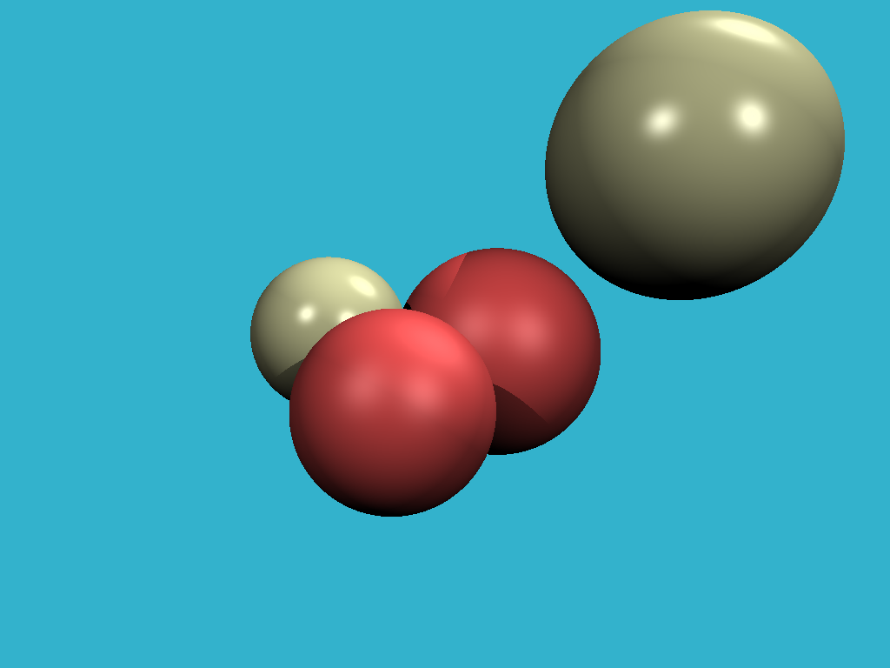

# pytinyraytracer
This is my fun implementation of the cool TinyRayTracer course here: https://github.com/ssloy/tinyraytracer

I used Python for fun. I'm not a Python expert so I may not be using best practices but I'm learning. It's slow, but it works!

For math/vectors I used Numpy, for image saving I used Pillow to save directly to PNG. I still think this is in the spirit of the original course in regards to third party libraries.

I'm currently starting on Step 9. Here's the current output:



In an attempt to speed things up, I used the Numba library which JITs the Python code using LLVM. See here for more details: https://numba.pydata.org/

Requirements:
* Python (I used 3.7.2)
* Numpy
* Scipy
* Numba
* Pillow (replacement for PIL)

```
$ pip install numba Pillow numpy scipy
$ python pyray.py
```
